# Task Manager API (todoapp)

A small FastAPI-based Task Manager API for creating, reading, updating and deleting personal tasks. The project demonstrates a minimal but complete stack using FastAPI, SQLAlchemy, Pydantic, JWT-based authentication, and SQLite for persistence. It includes tests that exercise the core user and task flows.

## Contents

- `app/` — application package
  - `main.py` — FastAPI app, routes/endpoints
  - `models.py` — SQLAlchemy models (`User`, `Task`)
  - `schemas.py` — Pydantic models (request/response shapes)
  - `auth.py` — authentication helpers (JWT creation, verify, password hashing)
  - `database.py` — database engine, session and helpers
- `tests/` — pytest tests for the main task flows
- `requirements.txt` — Python dependencies

## High-level architecture

- FastAPI provides the HTTP API layer and dependency injection (for DB sessions and auth).
- SQLAlchemy (Core + ORM) is used for persistent models and session management.
- Pydantic defines request/response schemas; `model_config = ConfigDict(from_attributes=True)` is used to read SQLAlchemy model attributes for responses.
- Authentication uses JWT (python-jose), with password hashing via `passlib[bcrypt]`. The token is returned by `/login` and used as a Bearer token for protected endpoints.
- SQLite (`sqlite:///./tasks.db`) is used as the default development database via SQLAlchemy.

This is deliberately small and focused so it can be a learning scaffold or small production prototype.

## Models and Data Shapes

- User (database model)
  - id: int (PK)
  - email: str (unique)
  - hashed_password: str
  - is_active: bool
  - created_at: datetime

- Task (database model)
  - id: int (PK)
  - owner_id: int (FK to users.id, stored as an integer)
  - title: str
  - description: Optional[str]
  - completed: bool
  - created_at: datetime
  - updated_at: datetime (auto-updated)

Pydantic schemas mirror these shapes in `app/schemas.py`:
- `TaskCreate`, `TaskUpdate`, `TaskResponse`
- `UserCreate`, `UserResponse`, and `Token` for login responses

## Endpoints

- `GET /` — simple welcome message.
- `POST /users` — register a new user. Request: `{ "email": "...", "password": "..." }`. Returns `UserResponse` (id, email, created_at).
- `POST /login` — obtain JWT token. Accepts OAuth2 form (`username` = email, `password`). Returns `{ "access_token": "...", "token_type": "bearer" }`.
- `POST /tasks` — create a task (authenticated). Body: `TaskCreate`.
- `GET /tasks` — list current user's tasks (authenticated).
- `GET /tasks/{task_id}` — get a specific task (authenticated, owner-only).
- `PUT /tasks/{task_id}` — update a task (authenticated, owner-only). Partial updates accepted through `TaskUpdate` with `exclude_unset` used in the view.
- `DELETE /tasks/{task_id}` — delete a task (authenticated, owner-only).

Authentication: supply header `Authorization: Bearer <access_token>` for protected endpoints.

## Security & Notes

- The JWT `SECRET_KEY` and other sensitive settings are hard-coded in `app/auth.py` for the demo. For any real deployment, move secrets to environment variables (e.g. `SECRET_KEY`, `DATABASE_URL`) and keep them out of source control.
- Passwords are hashed with bcrypt via `passlib` and truncated to 72 bytes before hashing to comply with bcrypt limits.
- The OAuth2 password flow (token URL `/login`) is used; all tokens expire after `ACCESS_TOKEN_EXPIRE_MINUTES` (default 30 minutes).

## Local development

1. Create a virtual environment and install dependencies:

```powershell
python -m venv .venv
.\.venv\Scripts\Activate.ps1
pip install -r requirements.txt
```

2. Run the app with Uvicorn (development):

```powershell
uvicorn app.main:app --reload
```

By default the app will create `tasks.db` (SQLite) in the project root when first run.

## Running tests

Tests use `pytest` and the `fastapi` TestClient. From the project root:

```powershell
pytest -q
```

The test suite exercises registration, login, task create/read/update/delete and unauthorized access cases.

## Development notes & possible improvements

- Move configuration (SECRET_KEY, DB URL, token expiry) into environment variables or a settings module (e.g. pydantic `BaseSettings`).
- Use Alembic for DB migrations instead of `Base.metadata.create_all` to manage schema changes.
- Add proper foreign key relationships for `Task.owner_id` to reference `users.id` if you want stronger DB-level constraints.
- Add pagination on `GET /tasks` for large datasets.
- Add rate limiting and more robust token revocation/refresh logic for production.

## How this README was generated

This README summarizes the current repository structure and behavior found in `app/` and `tests/`. If you want, I can also:

- add environment config using `pydantic` settings and update `auth.py` to read from env
- add a small `.env.example` and a short Makefile or PowerShell `ps1` script for common dev commands
- wire Alembic for migrations

---

If you want me to commit additional improvements (config, env handling, or CI), tell me which one to do next.
# todoapp